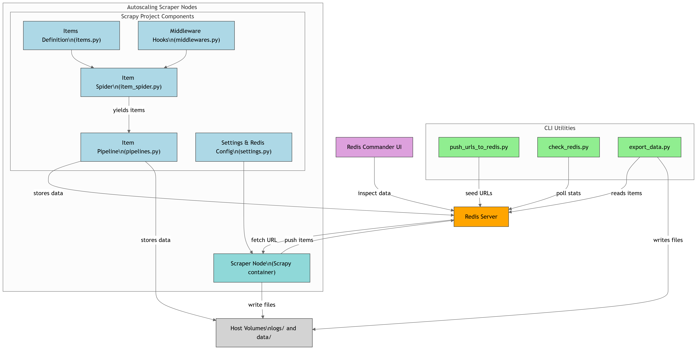
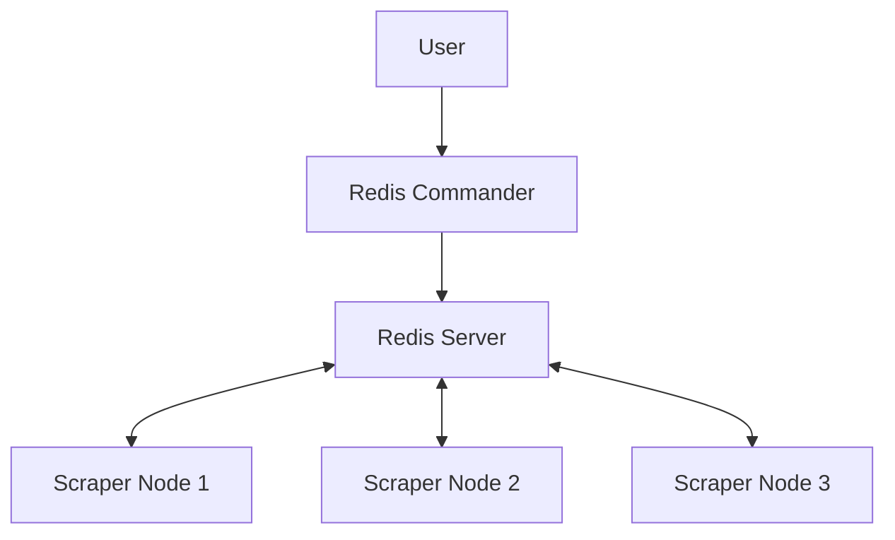

# Spacenets.tn Distributed Scraper

A high-performance, distributed web scraping system for Spacenets.tn, built with Scrapy, Redis, and Docker. This system leverages multiple scraper nodes working in parallel to efficiently extract product data.

## System Architecture

The scraping system is designed around modular, autoscaling Scrapy nodes that interact with a Redis server for distributed queue management and data sharing. Each scraper node independently fetches data and stores results.

### Key Components

#### Scrapy Project
- Includes `items.py`, `middlewares.py`, `item_spider.py`, and `pipelines.py`.

#### Redis Server
- Central queue and item store for scraper coordination.

#### Redis Commander
- GUI for inspecting Redis contents.

#### CLI Utilities
- `push_urls_to_redis.py`: Seeds the Redis queue with initial URLs.
- `check_redis.py`: Monitors scraper progress and stats.
- `export_data.py`: Extracts scraped data from Redis to files.

#### Host Volumes
- Persistent storage for logs and scraped data.

## Architecture Diagram

The following diagram visualizes the internal workflow:



### Diagram Highlights

- `item_spider.py` (Scrapy spider) uses `items.py` definitions and `middlewares.py` hooks to fetch data.
- Scraped items are processed via `pipelines.py`, and data is:
   - Sent to Redis
   - Stored in host-mounted `logs/` and `data/` directories
- `settings.py` includes both Scrapy and Redis integration config.
- CLI scripts interact directly with Redis to:
   - Seed URLs (`push_urls_to_redis.py`)
   - Poll stats (`check_redis.py`)
   - Export data (`export_data.py`)
- Redis Commander allows visual inspection of data queues and stored items.

## Prerequisites

- Docker and Docker Compose
- Python 3.9+
- Git

## Installation

1. Clone the repository:
      ```bash
      git clone https://github.com/Ibrahimghali/Spacenets.tn-Scraper.git
      cd Spacenets.tn-Scraper
      ```

2. Create a virtual environment and install dependencies:
      ```bash
      python -m venv .venv
      source .venv/bin/activate  # On Windows: .venv\Scripts\activate
      pip install -r requirements.txt
      ```

3. Create necessary directories:
      ```bash
      mkdir -p logs data
      ```

## System Architecture

The system employs a distributed architecture with the following components:

- **Redis Server**: Central coordination and data storage
- **Scraper Nodes**: Independent workers sharing the crawling workload
- **Redis Commander**: Web-based UI for monitoring Redis data
- **Docker Compose**: Orchestrates all components



## Usage

### Starting the Distributed Scraping System

1. Start the Docker containers:
      ```bash
      cd docker
      docker-compose up -d
      ```

2. Push initial URLs to Redis:
      ```bash
      python -m utils.push_urls_to_redis
      ```

3. Monitor scraping progress:
      ```bash
      python -m utils.check_redis --continuous
      ```

### Stopping the System

To stop the system:
```bash
cd docker
docker-compose down
```

### Monitoring Script

The system includes a monitoring script:
```bash
python -m utils.check_redis --continuous --debug
```

This provides real-time statistics, including:

- Pending URLs
- Visited URLs
- Processed Items
- Queued Requests

### Exporting Data

When scraping is complete, export the data:
```bash
python -m utils.export_data
```

## Project Structure

```
Spacenets.tn-Scraper/
├── docker/                     # Docker configuration
│   ├── Dockerfile
│   └── docker-compose.yml
├── logs/                       # Log files directory
├── data/                       # Data output directory
├── utils/                      # Utility scripts
│   ├── push_urls_to_redis.py   # Seeds Redis with URLs
│   ├── check_redis.py          # Monitoring script
│   └── export_data.py          # Data export script
├── spacenets/                  # Scrapy project
│   ├── spiders/
│   │   └── item_spider.py      # Main spider
│   ├── items.py                # Item definitions
│   ├── pipelines.py            # Processing pipelines
│   └── settings.py             # Scrapy settings
├── requirements.txt            # Python dependencies
└── scrapy.cfg                  # Scrapy configuration
```

## Performance Tuning

Optimize scraper performance by adjusting these parameters in `settings.py`:

- `CONCURRENT_REQUESTS`: Number of concurrent requests per node
- `DOWNLOAD_DELAY`: Delay between requests (in seconds)
- `CONCURRENT_REQUESTS_PER_DOMAIN`: Limit concurrent requests to the same domain
